# `fp` Library
`fp` is a binary-to-decimal and decimal-to-binary conversion library for IEEE-754 floating-point numbers.

It aims to be a building block for higher-level libraries with high-performance parsing/formatting procedures between human-readable strings and IEEE-754-encoded floating-point numbers.

## Goal
`fp` itself does not aim to have fastest string-to-float/float-to-string conversions with the greatest flexibility, because that is a too demanding task. Rather, `fp` focuses on fast mathematical algorithms for converting between binary IEEE-754 floating-point numbers and thier decimal floating-point representations. Implementers of string-to-float/float-to-string procedures then can utilize those algorithms to implement actual functions for parsing/formatting with their own constraints and goals.

# Included Algorithms
Here is the list of algorithms that `fp` supports (or will support in a future).

## Shortest-roundtrip binary-to-decimal conversion
`fp` implements [Dragonbox](https://github.com/jk-jeon/dragonbox) algorithm. `fp`'s implementation is almost identical to the reference implementation. The performance is better or on par with other contemporary algorithms; see [benchmark](https://github.com/jk-jeon/fp#benchmark).

## Fixed-precision binary-to-decimal conversion
`fp` implements Ulf Adams' [Ryu-printf](https://dl.acm.org/doi/pdf/10.1145/3360595) algorithm. One of the design goal of `fp`'s implementation of Ryu-printf is to cleanly separate the core algorithm (binary-to-decimal conversion) from the string generation. To achieve that goal, `fp` offers a stateful class `jkj::fp::ryu_printf<Float>` that implements the core algorithm, defined in the header [`jkj/fp/ryu_printf.h`](include/jkj/fp/ryu_printf.h).

`fp`'s implementation uses about `39KB` of static data, while the [reference implementation](https://github.com/ulfjack/ryu) uses about `102KB`, yet, `fp`'s implementation is faster for small precision and is comparable for large precision; see [benchmark](https://github.com/jk-jeon/fp#benchmark).

## Limited-precision decimal-to-binary conversion
To be prepared.

## Unlimited-precision decimal-to-binary conversion
To be prepared.

# Language Standard
The library is targetting C++17 and actively using its features (e.g., if constexpr).

# Benchmark

## Shortest-roundtrip binary-to-decimal conversion
Performance comparison of Ryu, Grisu-Exact, and `fp`'s implementation of Dragonbox for randomly generated samples with given digits (top: `float`, bottom: `double`):
(Clang)
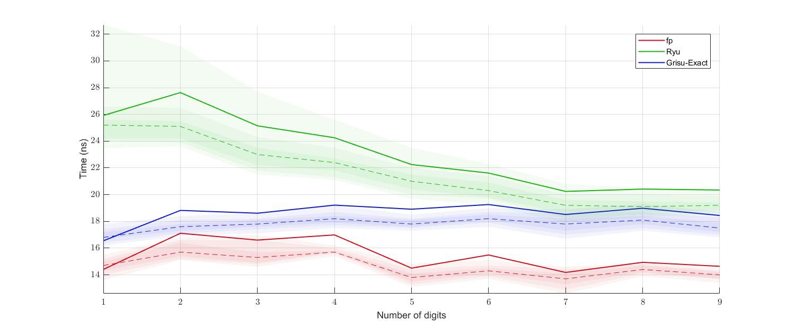
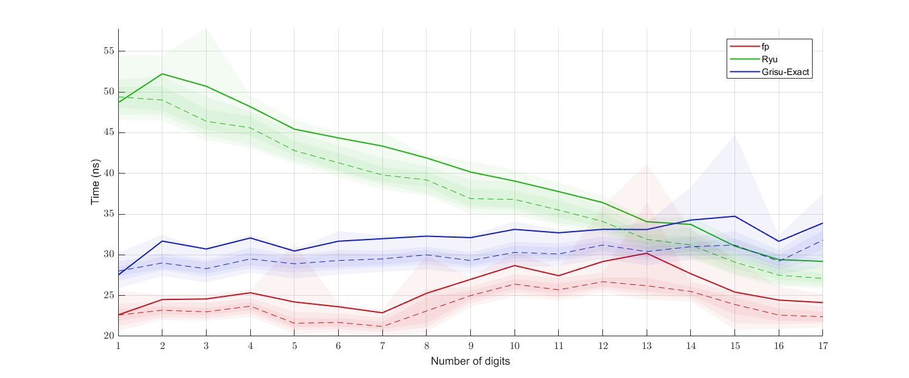

(MSVC)
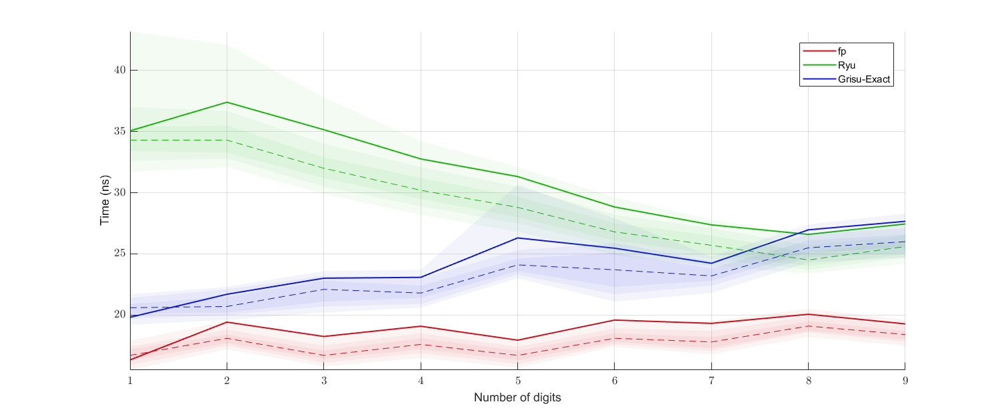
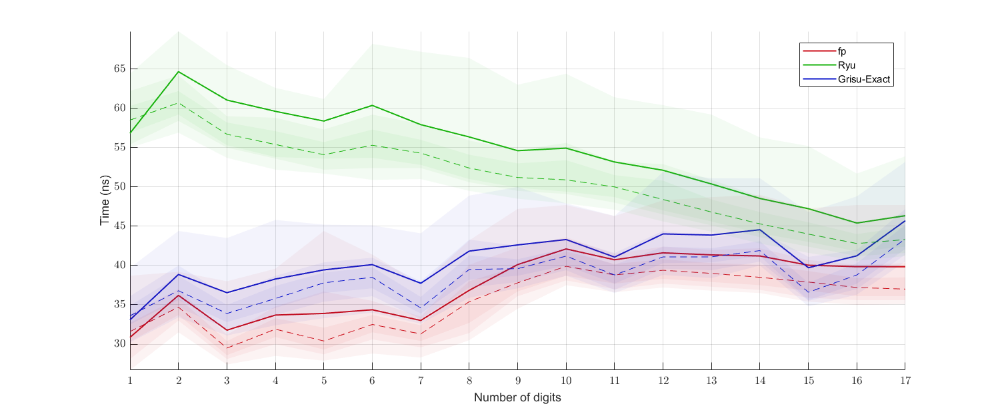

Performance comparison of Ryu, Grisu-Exact, and `fp`'s implementation of Dragonbox for uniformly randomly generated samples (top: `float`, bottom: `double`):
(Clang)
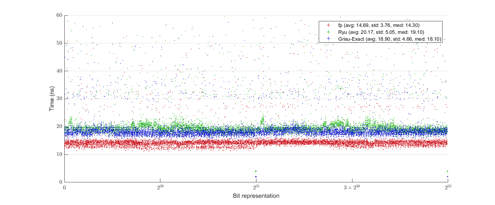
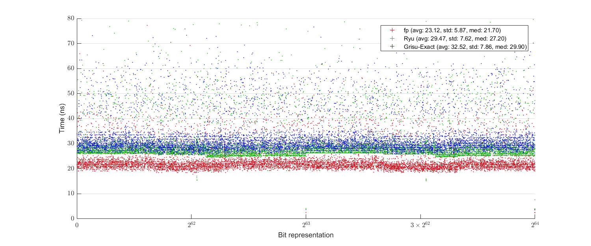

(MSVC)
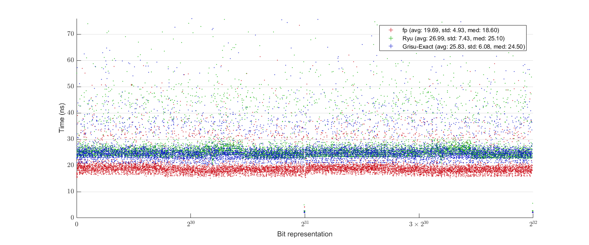
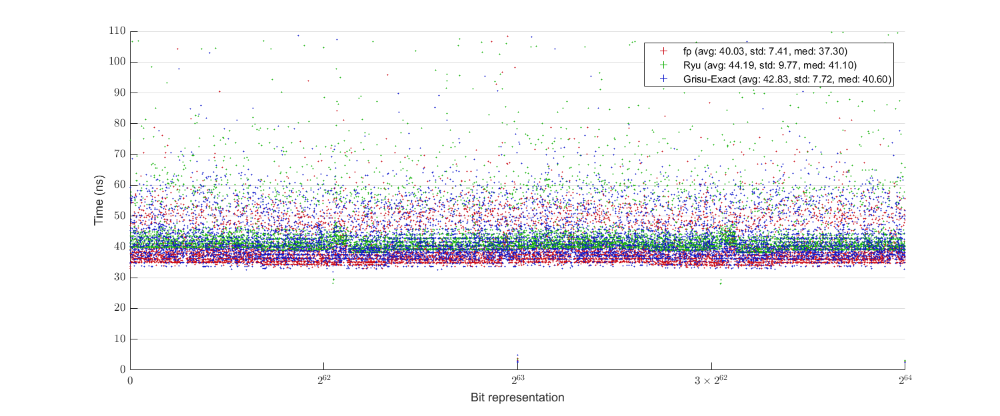

Performance comparison of Schubfach and `fp`'s implementation of Dragonbox for randomly generated samples with given digits (top: `float`, bottom: `double`; both implementations do not remove trailing decimal zeros):
(Clang)

(MSVC)

Performance comparison of Schubfach and `fp`'s implementation of Dragonbox for uniformly randomly generated samples (top: `float`, bottom: `double`; both implementations do not remove trailing decimal zeros):
(Clang)
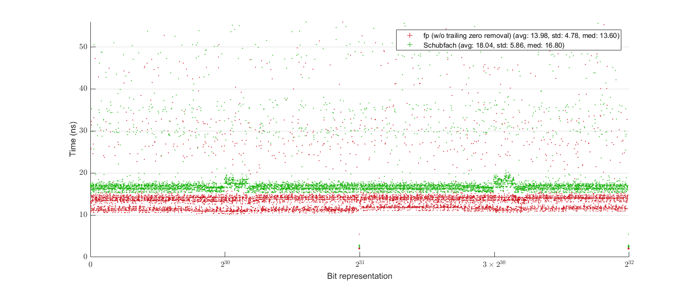
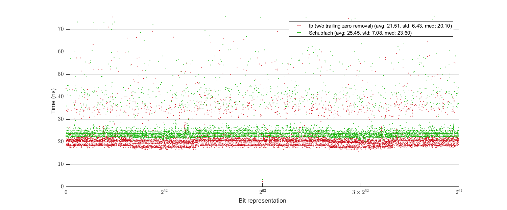

(MSVC)

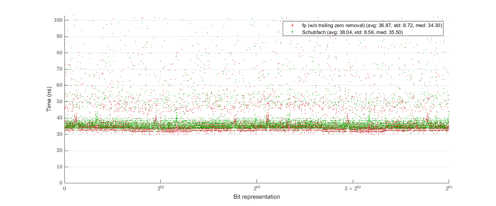

## Fixed-precision binary-to-decimal conversion
Average time consumed for a complete string generation in scientific format for given precision for uniformly randomly generated samples (top: `float`, bottom: `double`):

(Clang)
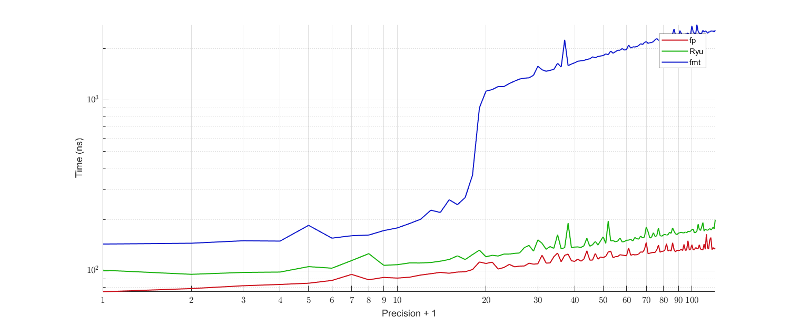
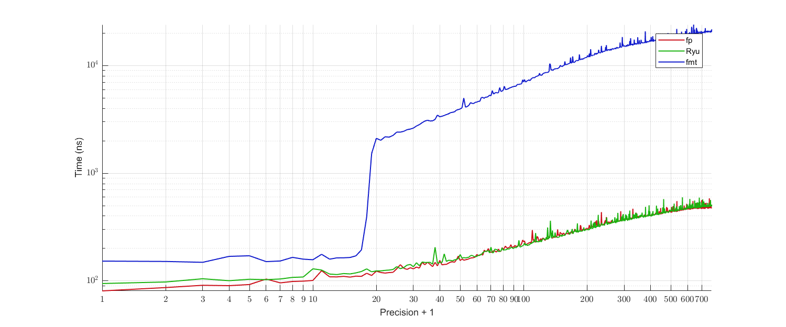

(MSVC)

# License
All code, except for those belong to third-party libraries, is licensed under either of

 * Apache License Version 2.0 with LLVM Exceptions ([LICENSE-Apache2-LLVM](LICENSE-Apache2-LLVM) or https://llvm.org/foundation/relicensing/LICENSE.txt) or
 * Boost Software License Version 1.0 ([LICENSE-Boost](LICENSE-Boost) or https://www.boost.org/LICENSE_1_0.txt).
