# `fp` Library
`fp` is a binary-to-decimal and decimal-to-binary conversion library for IEEE-754 floating-point numbers.

It aims to be a building block for higher-level libraries with high-performance parsing/formatting procedures between human-readable strings and IEEE-754-encoded floating-point numbers.

## Goal
`fp` itself does not aim to have fastest string-to-float/float-to-string conversions with the greatest flexibility, because that is a too demanding task. Rather, `fp` focuses on fast mathematical algorithms for converting between binary IEEE-754 floating-point numbers and thier decimal floating-point representations. Implementers of string-to-float/float-to-string procedures then can utilize those algorithms to implement actual functions for parsing/formatting with their own constraints and goals.

`fp` does provide some actual routines for string parsing/formatting, but the users are strongly recommended to write their own parsing/formatting routines as those provided by `fp` are quite primitive (especially parsing routines).

# Included Algorithms
Here is the list of algorithms that `fp` supports.

## Shortest-roundtrip binary-to-decimal conversion
`fp` implements [Dragonbox](https://github.com/jk-jeon/dragonbox) algorithm. `fp`'s implementation is almost identical to the reference implementation. The performance is better or on par with other contemporary algorithms; see [benchmark](https://github.com/jk-jeon/fp#shortest-roundtrip-binary-to-decimal-conversion-1).

## Fixed-precision binary-to-decimal conversion
`fp` implements Ulf Adams' [Ryu-printf](https://dl.acm.org/doi/pdf/10.1145/3360595) algorithm. One of the design goal of `fp`'s implementation of Ryu-printf is to cleanly separate the core algorithm (binary-to-decimal conversion) from the string generation. To achieve that goal, `fp` offers a stateful class `jkj::fp::ryu_printf<Float>` that implements the core algorithm, defined in the header [`jkj/fp/ryu_printf.h`](include/jkj/fp/ryu_printf.h).

`fp`'s implementation uses about `39KB` of static data, while the [reference implementation](https://github.com/ulfjack/ryu) uses about `102KB`, yet, `fp`'s implementation has  comparable performance with the original one; see [benchmark](https://github.com/jk-jeon/fp#fixed-precision-binary-to-decimal-conversion-1). A short paper about the implementation is in preparation.

## Limited-precision decimal-to-binary conversion
`fp` implements an algorithm for converting a decimal floating-point number with a limited precision into a binary floating-point number. This algorithm, which the author calls as *Dooly*, is based on a simple intuition obtained from Ryu. The author suspects that Dooly is in fact not very different from the string-to-float conversion algorithm developed by Ulf Adams, but the author didn't really look at Ulf's conversion algorithm so he doesn't know really. Perhaps, two algorithms may be different in some way, but as expected, the performance of Dooly and Ulf's algorithm seem to be similar; see [benchmark](https://github.com/jk-jeon/fp#limited-precision-decimal-to-binary-conversion-1). (`fp` shows a little better performance here, but that is probably because of the difference between string parsing routines. `fp`'s current implementation does fewer error checkings.) A short paper about Dooly is in preparation.

## Unlimited-precision decimal-to-binary conversion
By combining Dooly and a slight extension of Ryu-printf, it is possible to parse a floating-point number's decimal string representation of arbitrary length and obtain the best-approximating binary floating-point number. The resulting routine is way faster than the conventional methods, as shown in the [benchmark](https://github.com/jk-jeon/fp#unlimited-precision-decimal-to-binary-conversion-1). A short paper about this is in preparation.

# Language Standard
The library is targetting C++17 and actively using its features (e.g., if constexpr).

# Benchmark
All benchmark results here are compiled with clang-cl + Visual C++ 16.7 on a machine with Windows 10 and Intel(R) Core(TM) i7-7700HQ CPU @2.80GHz. Benchmarks are not completely fair in the sense that exact formatting, error conditions, error handlings, etc. are different. Also, as all the implementations here are in the nanosecond regime, things like different inlining decisions can matter a lot.

## Shortest-roundtrip binary-to-decimal conversion
Performance comparison of Ryu, Grisu-Exact, and `fp`'s implementation of Dragonbox for randomly generated samples with given digits (top: `float`, bottom: `double`):
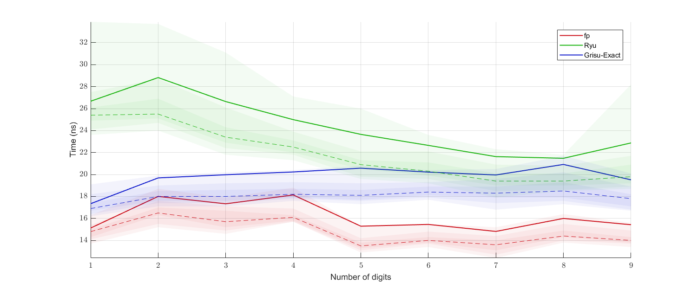
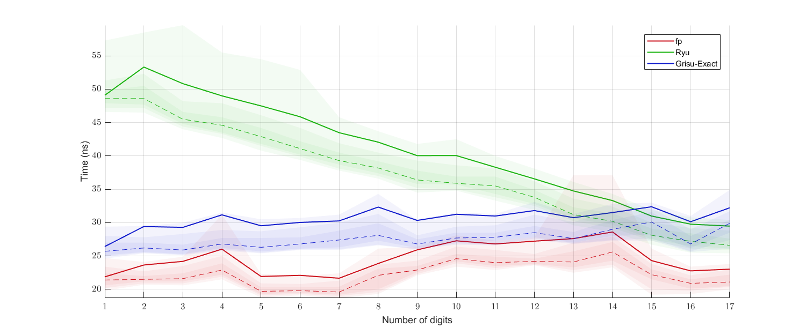

Performance comparison of Ryu, Grisu-Exact, and `fp`'s implementation of Dragonbox for uniformly randomly generated samples (top: `float`, bottom: `double`):
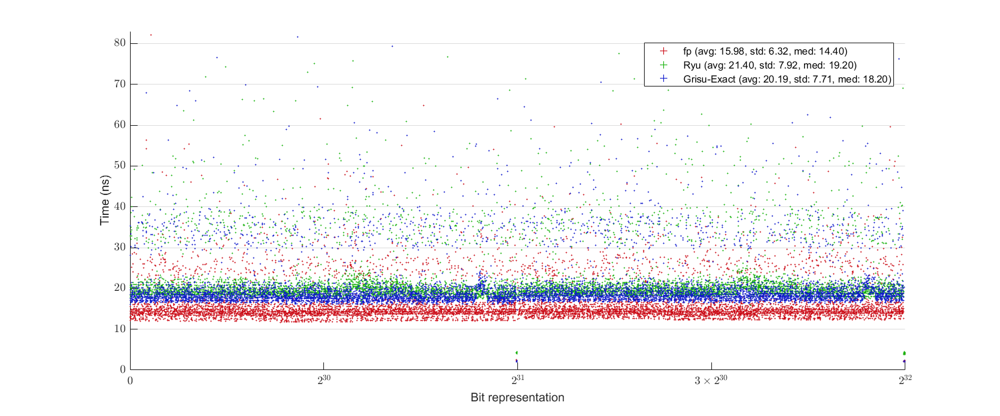
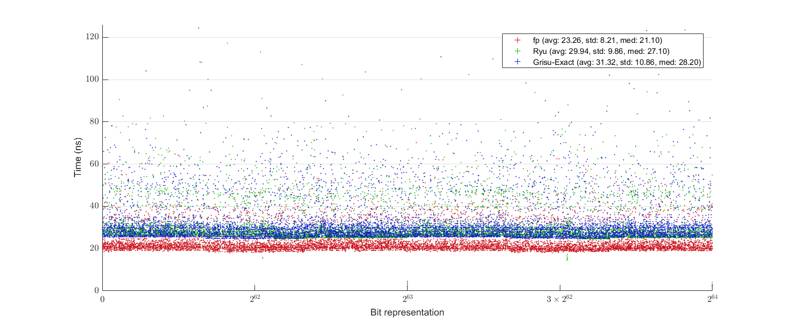

Performance comparison of Schubfach and `fp`'s implementation of Dragonbox for randomly generated samples with given digits (top: `float`, bottom: `double`; both implementations do not remove trailing decimal zeros):
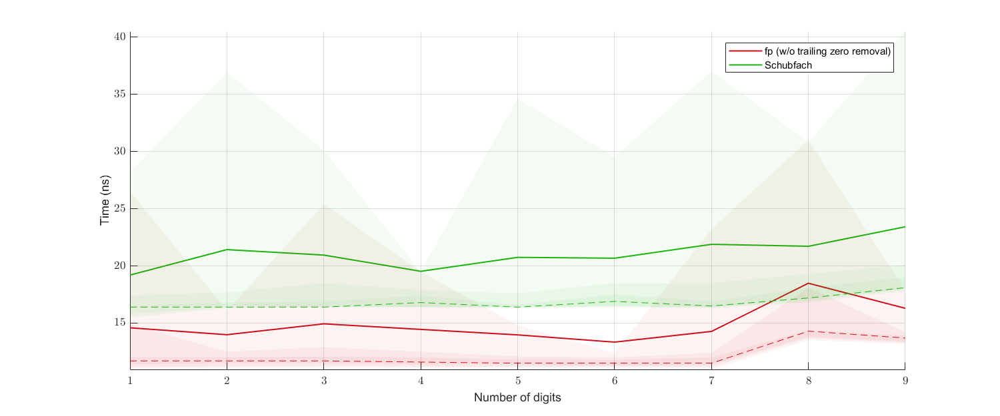
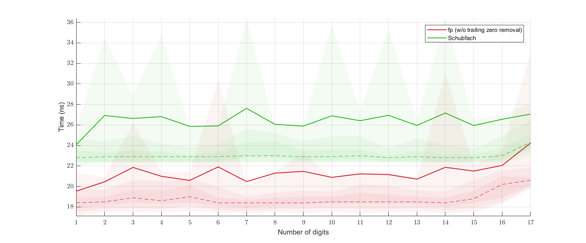

Performance comparison of Schubfach and `fp`'s implementation of Dragonbox for uniformly randomly generated samples (top: `float`, bottom: `double`; both implementations do not remove trailing decimal zeros):
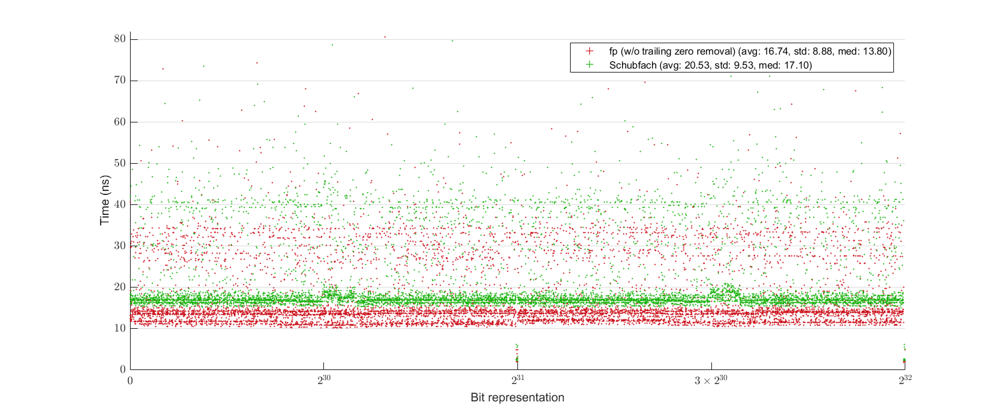
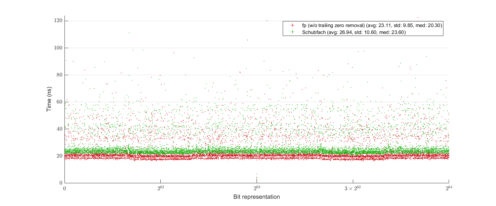

## Fixed-precision binary-to-decimal conversion
Average time consumed for a complete string generation in scientific format for given precision for uniformly randomly generated samples (top: `float`, bottom: `double`):
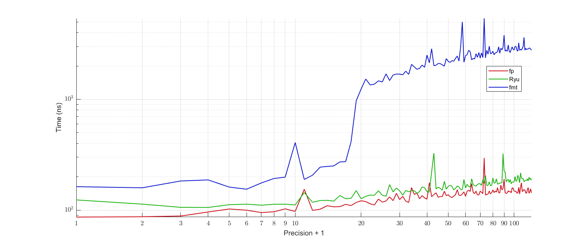
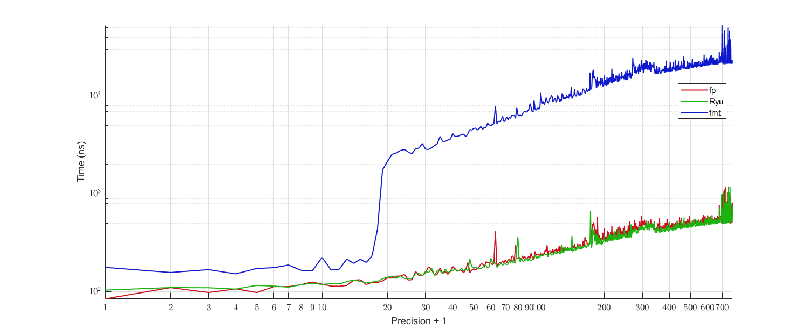

## Limited-precision decimal-to-binary conversion
Performance comparison of Ryu's `s2f/d2f` and `fp`'s implementation of Dooly for randomly generated samples with given digits (top: `float`, bottom: `double`; both implementations do not remove trailing decimal zeros):
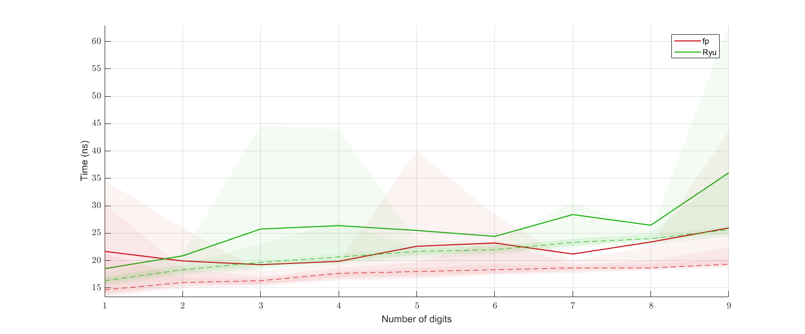
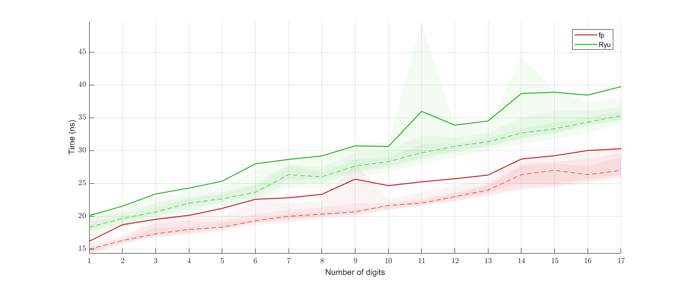

## Unlimited-precision decimal-to-binary conversion
Average time consumed for parsing string representations of uniformly randomly generated samples in scientific format with a given precision (top: `float`, bottom: `double`):
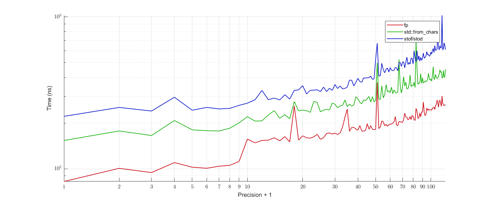
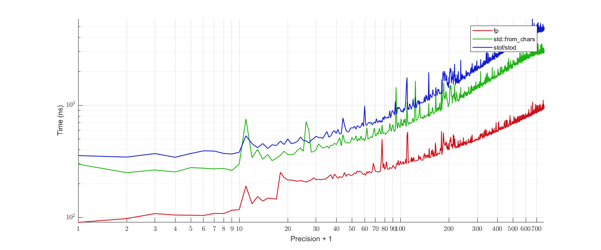

# License
All code, except for those belong to third-party libraries, is licensed under either of

 * Apache License Version 2.0 with LLVM Exceptions ([LICENSE-Apache2-LLVM](LICENSE-Apache2-LLVM) or https://llvm.org/foundation/relicensing/LICENSE.txt) or
 * Boost Software License Version 1.0 ([LICENSE-Boost](LICENSE-Boost) or https://www.boost.org/LICENSE_1_0.txt).
